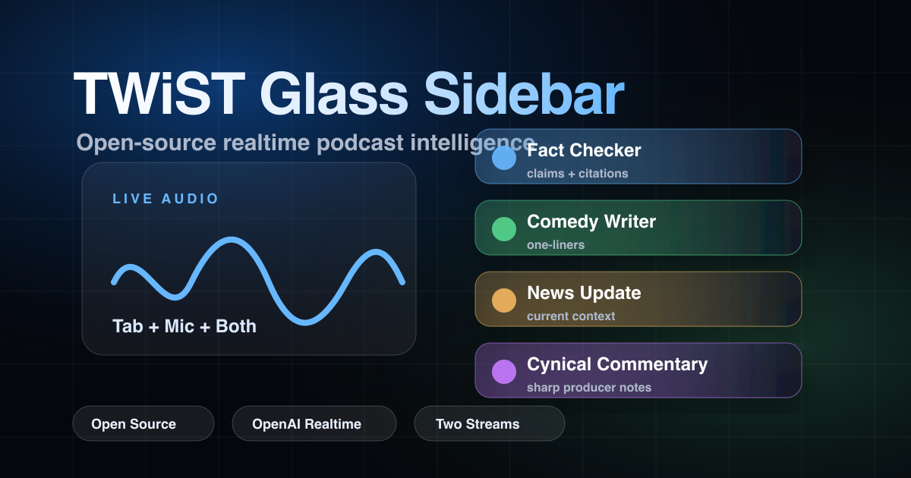

<div align="center">



<h1>TWiST Glass Sidebar</h1>
<p><strong>Real-time AI companion for live podcasts</strong></p>

[](./LICENSE)
[](https://nextjs.org)
[](https://platform.openai.com)
[](https://remotion.dev)
[](https://typescriptlang.org)
[](https://github.com/andookg/TWiST-Glass-Sidebar)
[](https://twistglasssidebar.netlify.app)

<br/>

[](https://youtu.be/KMeLNxoGffg)
[](https://twistglasssidebar.netlify.app)

</div>

---

## What it does

TWiST Glass Sidebar listens to your browser audio in real time and routes every useful moment to **four specialized AI minds** — all displayed live in a glass-morphism interface designed for broadcast.

| Persona | Role |
|---|---|
| ✅ **Fact Checker** | Catches errors before you make them |
| 😄 **Comedy Writer** | Drops one-liners on-air |
| 📰 **News Update** | Scans what's breaking right now |
| 🧐 **Cynical Commentary** | Keeps everything sharp and honest |

Record the regular show stream, record the enhanced sidebar stream, and hand the best moments to **Remotion**.

---

## Quick Start

```bash
git clone https://github.com/andookg/TWiST-Glass-Sidebar.git
cd TWiST-Glass-Sidebar
npm install
npm run activate
```

Open `http://127.0.0.1:3000` and add your API key in the **Setup** panel — or set it in `.env.local`:

```bash
OPENAI_API_KEY=
```

---

## Features

- 🎙️ **Browser Audio Capture** — Tab, Mic, or Both, simultaneously
- ⚡ **OpenAI Realtime Transcription** — WebRTC streaming, ultra-low latency
- 🧠 **4 AI Persona Workers** — Parallel, independent, persona-scoped
- 🎬 **Two-Stream Recording** — Save the regular show stream or enhanced sidebar stream
- 🔀 **Model Router** — OpenAI · OpenRouter · Custom Gateway
- ✂️ **Clip Studio** — AI-detected moments + Remotion MP4 handoff
- 🤖 **Agent Ready** — Full `/api/agent/brief` endpoint for home base agent integration
- 📦 **Project Memory** — Persistent context across sessions
- 🗂️ **Memory Stash** — Attach files (code, docs, notes) as AI context
- 💾 **Storage Adapters** — Local JSONL · Webhook · Custom API · Supabase
- 🔒 **Security First** — Keys server-side only, never exposed to client

---

## Agent Activation

The entire system is ready to activate with your own home base agent. Once running:

```bash
curl http://127.0.0.1:3000/api/agent/brief?projectId=default
curl "http://127.0.0.1:3000/api/agent/brief?projectId=default&format=md"
```

See [AGENTS.md](./AGENTS.md) and [docs/AGENT_ACTIVATION.md](./docs/AGENT_ACTIVATION.md).

---

## Customize Everything

Once you download it, you can add, change, and make it your own:

- **Models** — swap OpenAI for any OpenAI-compatible provider
- **Personas** — edit prompts, add new roles, change behaviors
- **Storage** — local file, Supabase, or your own webhook
- **UI** — full Next.js 15 + React codebase, modular hook architecture

---

## Commands

```bash
npm run setup       # create .env.local and .data/
npm run activate    # setup + start dev server
npm run desktop     # open native macOS-friendly capture wrapper
npm run desktop:pack # build a local .app bundle in dist-desktop/
npm run dev:local   # start on 127.0.0.1:3000
npm run doctor      # safety + secret checks
npm run typecheck   # TypeScript check
npm run build       # production build
npm run verify      # typecheck + build
```

---

## Native Desktop Capture

If your browser cannot expose tab audio or microphone devices, use the Electron wrapper:

```bash
npm run desktop
```

It starts the local app, opens a standalone desktop window, requests macOS microphone permission, and uses Electron display capture for screen/tab capture. If macOS blocks capture, enable **TWiST Glass Sidebar** or **Electron** in System Settings -> Privacy & Security -> Screen & System Audio Recording.

To create a local macOS app bundle:

```bash
npm run desktop:pack
open "dist-desktop/mac/TWiST Glass Sidebar.app"
```

---

## Environment Variables

```bash
# Required
OPENAI_API_KEY=

# Optional – model overrides
OPENAI_TRANSCRIBE_MODEL=gpt-realtime-whisper
OPENAI_PERSONA_MODEL=gpt-4o
OPENAI_REALTIME_MODEL=gpt-realtime-2

# Optional – alternate providers
OPENROUTER_API_KEY=
AI_GATEWAY_BASE_URL=
AI_GATEWAY_API_KEY=

# Optional – storage
DATA_STORAGE_PROVIDER=none        # local | webhook | custom | supabase
SUPABASE_URL=
SUPABASE_TABLE=twist_sidebar_events
```

---

## Remotion Clip Studio

```bash
cd remotion-clips
npm install
npm run dev
npx remotion render src/index.ts ClipSuggestion out/sample.mp4 --props src/sample-props.json
```

---

## Security

- API keys **never** leave your server
- No data stored without your explicit permission
- `.data/`, `.env*`, and `node_modules/` are gitignored by default

Read [SECURITY.md](./SECURITY.md) before deploying.

---

## API Routes

| Route | Method | Description |
|---|---|---|
| `/api/realtime/session` | POST | Transcription session token |
| `/api/realtime/voice-session` | POST | Voice agent session |
| `/api/realtime/translate-session` | POST | Translation session |
| `/api/personas/analyze` | POST | Run persona analysis |
| `/api/clips/suggest` | POST | Clip suggestion |
| `/api/agent/brief` | GET | Machine-readable project manifest |
| `/api/memory/stash` | GET/POST | Memory stash operations |
| `/api/agent/clip-handoff` | GET/POST | Remotion clip handoff |

---

## Architecture

```
app/
├── hooks/          # 10 modular custom hooks (audio, transcription, personas, etc.)
├── components/     # Shared UI components (ErrorBoundary, PersonaAvatar, etc.)
├── utils/          # Format utilities
├── api/            # Server-side API routes
└── page.tsx        # Thin orchestrator component

remotion-clips/     # Remotion clip rendering template
promo-video/        # Promo video source (Remotion)
```

---

## License

MIT — see [LICENSE](./LICENSE).

Built with ❤️ for the podcast community.
